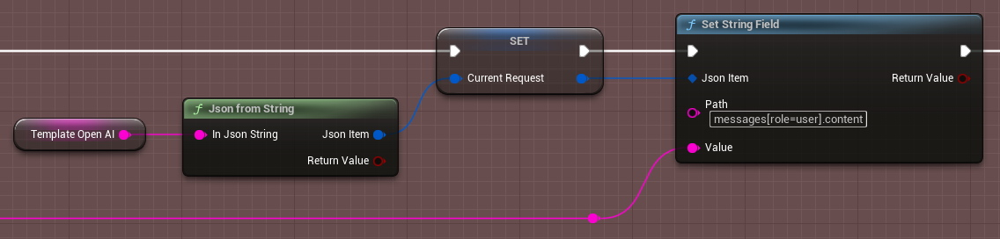
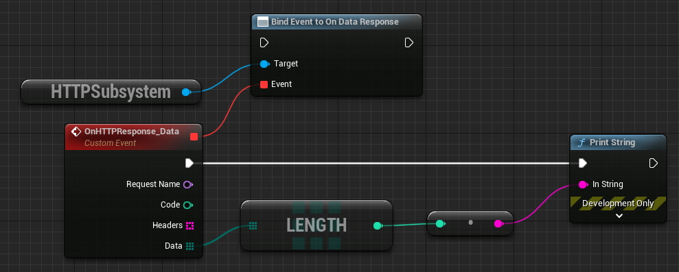
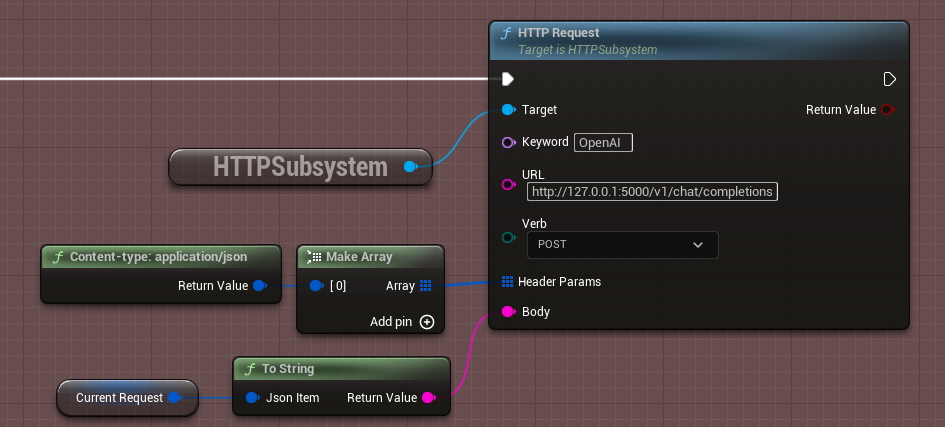

# Description

This is very lightweight plugin to send HTTP requests and parse JSON in bluerpints.

Demo project shows interaction with two neural models: text-generative and text-to-speech.

[Youtube Video](https://youtu.be/aI2wegZCW0Y)

I used [text-generation-webui](https://github.com/oobabooga/text-generation-webui) to run [this model](https://huggingface.co/TheBloke/Wizard-Vicuna-13B-Uncensored-GPTQ) and [this fork](https://github.com/daswer123/xtts-finetune-webui) of coqui TTS. Demo project also uses [Runtime AUdio Importer](https://unrealengine.com/marketplace/product/runtime-audio-importer) plugins (it's free on Unreal Marketplace).

# How to use

Json parser starts with two global functions: "Json from File" and "Json from String". After you created JsonItem variable, read or write any item using SetBooleanField, SetNumericField, SetStringField and GetBooleanField, GetNumericField, GetStringField. All these functions require path, with consists of hierarchy of json objects separated by dot (.) symbol. For arrays use square brackets with element index or name of a field inside.

For exmaple, standard OpenAI request looks like this:

```
{
    "messages": [
      {
        "role": "user",
        "content": "Hello! Who are you?"
      },
      {
        "role": "system",
        "content": "Answer in rhyme."
      }
    ],
    "mode": "chat"
  }
```

Path to user content is **messages[role="user"].content** (quotes are optional) or **messages[0].content**.



To send HTTP requests, use HTTPSubsystem. It has three useful events OnTextResponse, OnDataResponse and OnResponseError and simple function HTTPRequest.




